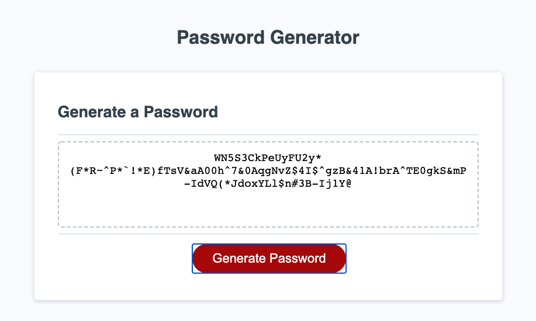

# Password Magic Random Password Generator
This application will generate a random password based criteria specified by the user. The user will click the red "Generate Password" button and they will be prompted to answer the following questions:

1.) How many characters long would you like your password to be? (Between 8 - 128 characters.)
2.) Would you like to include uppercase letters?
3.) Would you like to include lowercase letters?
4.) Would you like to include numbers?
5.) Would you like to include special characters?

Upon gathering user input, the application will generate a random password based on the input criteria.

# Screenshot of Application
The following image shows the web applicagtions appearance and functionality:

# Web Address

[Password Magic Password Generator](https://bleufox.github.io/PasswordMagic/)