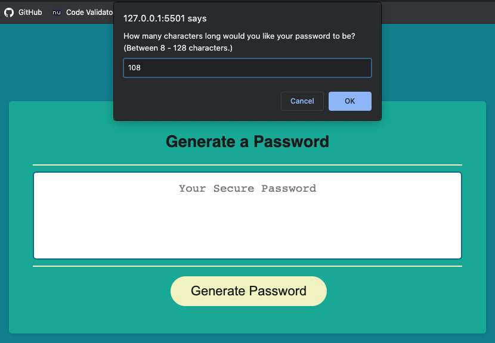

# "Password Magic" Random Password Generator

## Description
This application will generate a random password based criteria specified by the user. The user will click the red "Generate Password" button and they will be prompted to answer the following questions:

* How many characters long would you like your password to be? (Between 8 - 128 characters.)
* Would you like to include uppercase letters?
* Would you like to include lowercase letters?
* Would you like to include numbers?
* Would you like to include special characters?

## Technologies Used
* HTML
* CSS 
* Javascript

## Screenshot

## Links
* [Password Magic Password Generator](https://bleufox.github.io/PasswordMagic/)
* [Password Magic Git Hub Repo](https://github.com/bleufox/PasswordMagic)

## License
* MIT

## Contact Information
* thebleufox8@gmail.com
* 541-505-5287